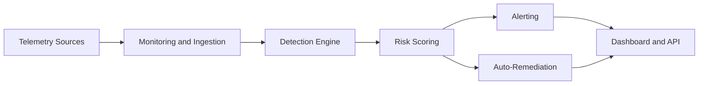
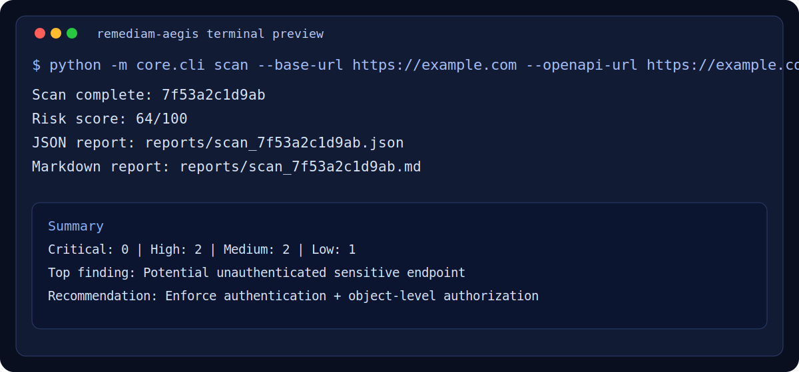

# 🚀 Remediam Aegis
### AI-powered threat detection, behavior analysis, and automated remediation

[](https://github.com/SaieshwarTech/remediam-aegis/actions)
[](./LICENSE)
[](#)
[](https://github.com/SaieshwarTech/remediam-aegis/issues)
[](https://github.com/SaieshwarTech/remediam-aegis/stargazers)
[](https://github.com/SaieshwarTech/remediam-aegis/network/members)
[](#)

Remediam Aegis is an AI-powered security and monitoring system that detects threats, analyzes system behavior, and provides automated remediation guidance.
It helps teams move from reactive incident handling to proactive, real-time defense with clear, actionable insights.

## 🧠 Problem Statement

Most teams, especially startups and SMBs, lack practical 24/7 security monitoring.
Logs are noisy, alerts are fragmented across tools, and incidents are discovered too late.
Traditional setups are expensive, complex, and hard to operationalize for lean engineering teams.

## 💡 Solution

Aegis provides an integrated security workflow:

- Ingest telemetry from APIs, services, and logs
- Detect suspicious behavior using rule-based + AI-assisted analysis
- Prioritize threats with risk scoring
- Trigger alerts and suggest or execute safe remediation steps

This gives teams one product for detection, triage, and first-response automation.

## ⚙️ Features

- Real-time threat detection across API and system activity
- AI-assisted log and behavior analysis for anomaly identification
- Severity-based alerting via email, Slack, and webhook-ready channels
- Automated remediation workflows with policy guardrails
- Risk scoring and incident summaries for fast triage
- JSON and Markdown reporting for audits and compliance
- API-first architecture for easy CI/CD and SOC integration

## 🏗️ Architecture Overview

Aegis follows a modular security pipeline:

1. Signal ingestion from logs, APIs, and runtime events
2. Detection engine combines security rules + AI analysis
3. Risk engine scores and prioritizes incidents
4. Alert service routes notifications
5. Remediation engine runs approved response actions
6. API/dashboard layer exposes visibility and controls



Structure docs:
- [Modular package plan](./aegis/README.md)
- [Project structure and scaling](./docs/PROJECT_STRUCTURE.md)

## 📸 Demo Section

### CLI Demo


### Architecture Snapshot


### Dashboard Screenshot Placeholder
Add screenshot at: `./docs/media/demo-dashboard.png`

### Incident Timeline Placeholder
Add screenshot at: `./docs/media/demo-incidents.png`

## 🧪 Example Use Cases

- Detect suspicious login bursts and trigger IP block remediation
- Flag leaked tokens/keys in API responses or logs
- Identify shadow endpoints not present in approved inventory
- Alert on risky API method exposure (`PUT`, `PATCH`, `DELETE`)
- Generate daily security posture reports for engineering leadership

## 🛠️ Tech Stack

- Backend: Python, FastAPI
- Detection Layer: Rule engine + AI-assisted analyzers
- Monitoring: HTTP/API probes + structured log analysis
- Alerting: Email/Slack/Webhooks (extensible)
- Data/Storage: JSON reports (extensible to PostgreSQL/Redis)
- CI/CD: GitHub Actions

## 🚀 Installation Guide

### 1) Clone

```bash
git clone https://github.com/SaieshwarTech/remediam-aegis.git
cd remediam-aegis
```

### 2) Setup Environment

```bash
python3 -m venv .venv
source .venv/bin/activate
pip install -r requirements.txt
```

### 3) Run CLI Scan

```bash
python3 -m core.cli scan \
  --base-url https://example.com \
  --openapi-url https://example.com/openapi.json \
  --baseline-file docs/example_baseline_endpoints.txt
```

### 4) Run API Server

```bash
uvicorn app.main:app --host 0.0.0.0 --port 8080 --reload
```

### 5) Health Check

```bash
curl http://localhost:8080/health
```

## 📈 Future Roadmap

- Multi-tenant architecture for SaaS deployment
- SIEM integrations (Splunk, Elastic, Datadog)
- Threat intelligence feed enrichment
- SARIF output and policy packs for security pipelines
- RBAC, audit trails, and compliance modules
- Remediation marketplace with pluggable responders

Business vision:
- [SaaS vision](./docs/SAAS_VISION.md)
- [Demo and wow-factor ideas](./docs/DEMO_IDEAS.md)

## 🤝 Contribution Guide

Contributions are welcome.

1. Fork the repository
2. Create a feature branch
3. Add code and tests
4. Open a PR with clear context and impact

Focus areas:

- High-signal detections with low false positives
- Secure-by-default remediation actions
- Clear evidence and remediation guidance

See [CONTRIBUTING.md](./CONTRIBUTING.md).

## 📜 License

MIT License. See [LICENSE](./LICENSE).
